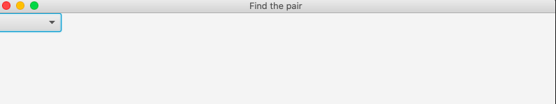
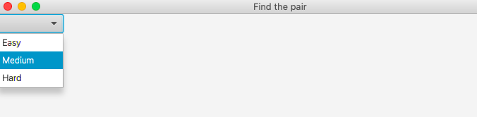
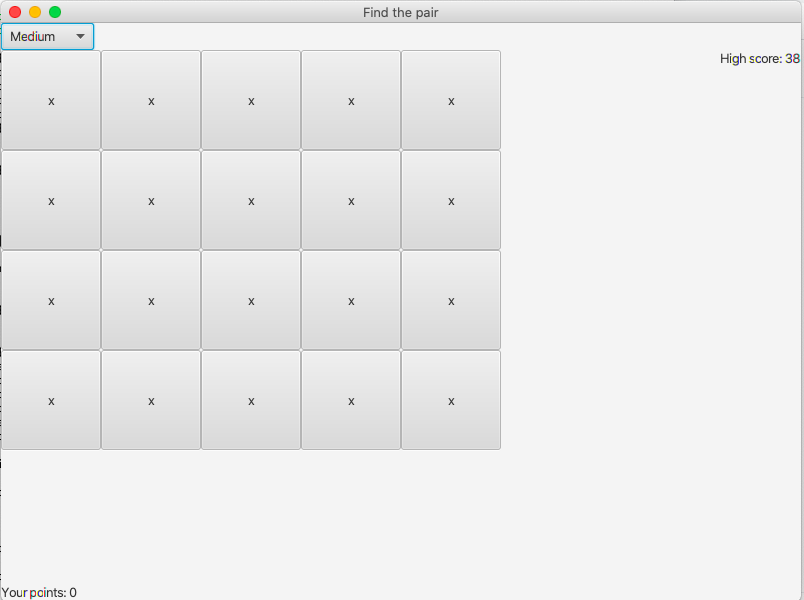
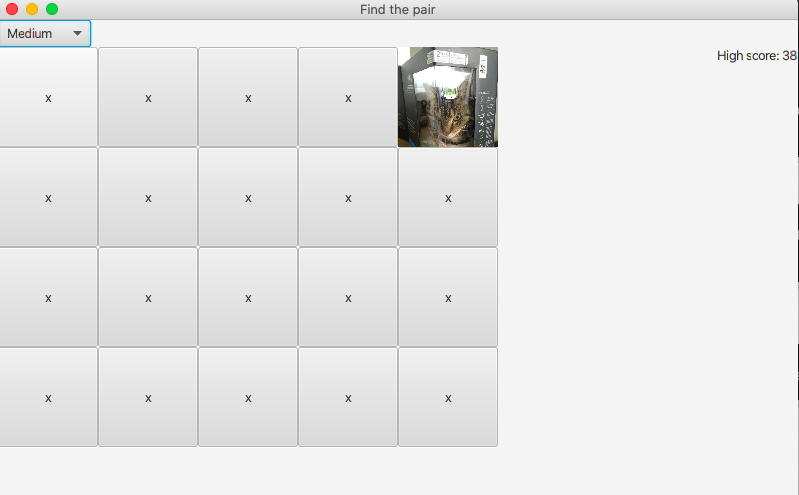
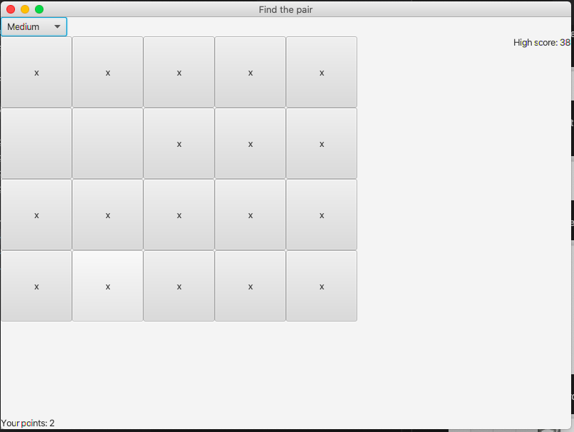

# Instructions

## Playing the game

This will be the first view when the game is opened:

First, the player has to select the difficulty level:

Then, the game view will open:

Now the player can flip a card:

If the cards match, they will disappear:

This will continue as long as there are cards left.