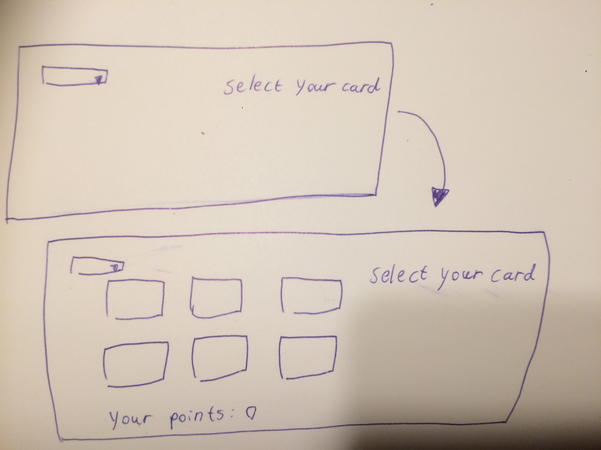

# Requirements analysis 

## Description

The game is a classic concentration game. The player's goal is to find matching cards by flipping them two at a time.

## Users

There is only one user role, regular user/player.

## Interface draft

The application has two views

The opening views just has a drop-down list of which the player can choose the difficulty level. After selecting the level, the card display opens. Now the player can tap the cards.

## Functionality

- Before the game starts, the user will select the difficulty level (this can be changed at any time during the game)
- The player can flip the cards by tapping the card buttons
- When the player flips a pair for the first card, the player will either receive 5 points if they match, or lose 1 point if they don't
- The game will continue until all the matching cards are found

## Further development ideas

- Registering and logging in/out
- Keeping track of each players' high scores
- More card themes to choose from
- "Play again" button after all the pairs are found